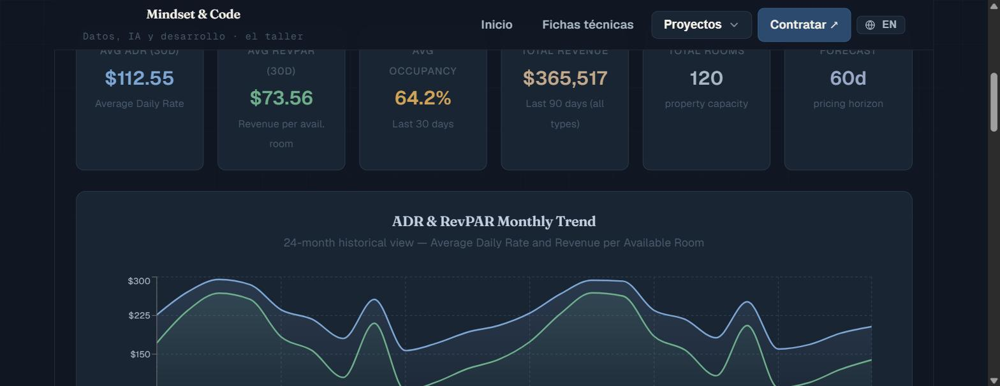

# Hotel Dynamic Pricing Engine — Revenue Management

> **Revenue Management portfolio project** · Python · 6-factor pricing algorithm
> **Status:** Finished · Live on portfolio
> A dynamic pricing engine for a 120-room hotel: it generates two years of history and a 60-day forecast, setting the optimal room rate each day from six demand factors — the core logic behind hotel revenue management.

> 🇬🇧 **English version first.** · 🇪🇸 **La versión en español está más abajo** → [ir a Español](#-español).

[](https://proyectos-mindset-code.web.app/hotel)
[](https://mindset-code.com/es/codigo)
[](.)
[](.)
[](LICENSE)

[](https://proyectos-mindset-code.web.app/hotel)

*[Open the live demo](https://proyectos-mindset-code.web.app/hotel)*

---

## The problem this solves

A hotel room is a perishable asset: an empty room tonight is revenue lost forever. Revenue Management answers *"what price maximizes revenue for each room, each night?"* — too high and rooms sit empty, too low and money is left on the table. This engine encodes that decision as an algorithm, pricing each room type daily from six demand signals, and projects the revenue impact 60 days out.

It demonstrates the analytical core of Revenue Management — the discipline behind airline, hotel and SaaS pricing.

**▶ Live dashboard: [proyectos-mindset-code.web.app/hotel](https://proyectos-mindset-code.web.app/hotel)**

---

## The pricing model — 6 factors

Each day, the base price of every room type is adjusted by six multiplicative factors:

| Factor | Logic |
|--------|-------|
| **Base price** | Standard $120 · Deluxe $185 · Suite $320 |
| **Seasonality** | Monthly index (Jan 0.72 → Jul 1.35) |
| **Day of week** | Saturday ×1.25 · Monday ×0.90 |
| **Local events** | Jul 4th ×1.45 · Dec 31st ×1.55 |
| **Occupancy pressure** | >85% occ ×1.10 · <60% ×0.92 |
| **Lead time** | Last-minute premium within 30 days |

The final price is clipped to a **70%–220%** band around the base price to stay realistic. Inventory: **120 rooms** split 55% Standard / 32% Deluxe / 13% Suite.

---

## What it produces

- **730 days of history** + a **60-day forecast** across 3 room types.
- Revenue-management KPIs: **ADR** (Average Daily Rate), **RevPAR** (Revenue per Available Room) and **occupancy**.
- JSON exports (`data/`) consumed by the React dashboard: KPIs, monthly trend, revenue by room, occupancy by day-of-week, forecast and the pricing-factor table.

Fully reproducible (`np.random.seed(42)`).

---

## Tech stack

| Layer | Technology |
|-------|-----------|
| Language | Python 3.12 |
| Data | Pandas · NumPy |
| Visualization | React · Recharts (dashboard) |
| Domain | Revenue Management · Dynamic Pricing |

---

## Getting started

```bash
git clone https://github.com/mindset-code/project-hotel-pricing-engine.git
cd project-hotel-pricing-engine
python -m venv .venv && source .venv/bin/activate
pip install -r requirements.txt

python dynamic_pricing_engine.py    # writes history + forecast + JSON to data/
```

---

## Repository structure

```
project-hotel-pricing-engine/
├── dynamic_pricing_engine.py  # pricing engine: history + forecast + JSON export
├── data/                      # generated CSV/JSON output (JSON versioned for the dashboard)
├── requirements.txt           # Python dependencies
├── LICENSE                    # MIT
└── README.md
```

---

## License & contact

Released under the **[MIT License](LICENSE)**.

- **Portfolio:** [proyectos-mindset-code.web.app](https://proyectos-mindset-code.web.app)
- **Web:** [mindset-code.com](https://mindset-code.com/es)
- **Email:** contacto@mindset-code.com

---

# 🇪🇸 Español

# Hotel Dynamic Pricing Engine — Revenue Management

> **Proyecto de portafolio de Revenue Management** · Python · algoritmo de pricing de 6 factores
> **Estado:** Terminado · Publicado en el portafolio
> Motor de precios dinámicos para un hotel de 120 habitaciones: genera dos años de histórico y un forecast de 60 días, fijando la tarifa óptima cada día a partir de seis factores de demanda — la lógica central del revenue management hotelero.

> 🇪🇸 Traducción al español. La versión en inglés está al inicio → [ir a English](#hotel-dynamic-pricing-engine--revenue-management).

---

## El problema que resuelve

Una habitación de hotel es un activo perecedero: una habitación vacía esta noche es ingreso perdido para siempre. El Revenue Management responde *"¿qué precio maximiza el ingreso de cada habitación, cada noche?"* — demasiado alto y queda vacía, demasiado bajo y se deja dinero sobre la mesa. Este motor codifica esa decisión como un algoritmo, fijando el precio de cada tipo de habitación a diario a partir de seis señales de demanda, y proyecta el impacto en ingresos a 60 días.

Demuestra el núcleo analítico del Revenue Management — la disciplina detrás del pricing de aerolíneas, hoteles y SaaS.

**▶ Dashboard en vivo: [proyectos-mindset-code.web.app/hotel](https://proyectos-mindset-code.web.app/hotel)**

---

## El modelo de pricing — 6 factores

Cada día, el precio base de cada tipo de habitación se ajusta por seis factores multiplicativos:

| Factor | Lógica |
|--------|--------|
| **Precio base** | Standard $120 · Deluxe $185 · Suite $320 |
| **Estacionalidad** | Índice mensual (Ene 0,72 → Jul 1,35) |
| **Día de la semana** | Sábado ×1,25 · Lunes ×0,90 |
| **Eventos locales** | 4-Jul ×1,45 · 31-Dic ×1,55 |
| **Presión de ocupación** | >85% ocup ×1,10 · <60% ×0,92 |
| **Lead time** | Premium last-minute dentro de 30 días |

El precio final se acota a una banda **70%–220%** sobre el base para ser realista. Inventario: **120 habitaciones** repartidas 55% Standard / 32% Deluxe / 13% Suite.

---

## Qué produce

- **730 días de histórico** + un **forecast de 60 días** en 3 tipos de habitación.
- KPIs de revenue management: **ADR** (tarifa media diaria), **RevPAR** (ingreso por habitación disponible) y **ocupación**.
- Exportaciones JSON (`data/`) que consume el dashboard React: KPIs, tendencia mensual, revenue por habitación, ocupación por día de semana, forecast y la tabla de factores.

Totalmente reproducible (`np.random.seed(42)`).

---

## Stack técnico

| Capa | Tecnología |
|------|-----------|
| Lenguaje | Python 3.12 |
| Datos | Pandas · NumPy |
| Visualización | React · Recharts (dashboard) |
| Dominio | Revenue Management · Pricing Dinámico |

---

## Cómo empezar

```bash
git clone https://github.com/mindset-code/project-hotel-pricing-engine.git
cd project-hotel-pricing-engine
python -m venv .venv && source .venv/bin/activate
pip install -r requirements.txt

python dynamic_pricing_engine.py    # genera histórico + forecast + JSON en data/
```

---

## Estructura del repositorio

```
project-hotel-pricing-engine/
├── dynamic_pricing_engine.py  # motor de pricing: histórico + forecast + export JSON
├── data/                      # salida CSV/JSON generada (JSON versionado para el dashboard)
├── requirements.txt           # dependencias Python
├── LICENSE                    # MIT
└── README.md
```

---

## Licencia y contacto

Publicado bajo la **[Licencia MIT](LICENSE)**.

- **Portafolio:** [proyectos-mindset-code.web.app](https://proyectos-mindset-code.web.app)
- **Web:** [mindset-code.com](https://mindset-code.com/es)
- **Email:** contacto@mindset-code.com

---

*Mindset & Code · asesoría fiscal y tecnológica · [mindset-code.com](https://mindset-code.com/es)*
